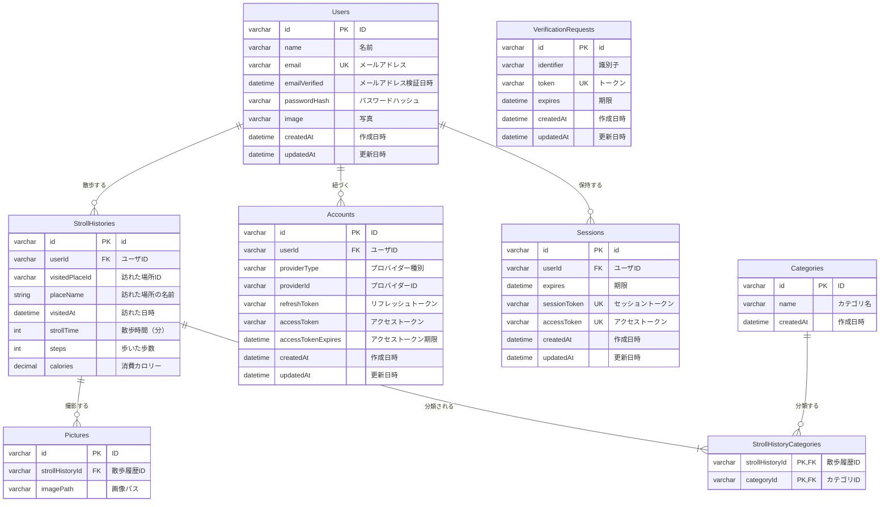

## アプリケーション要件定義書

### 1. 目的

休日の散歩先に迷う20代の一人利用者に対して、新しい場所へ訪れるきっかけを提供する。このドキュメントではMVP（Minimum Viable Product）として必要な最低限の機能セットを定義しています。

---

### 2. 背景・課題

- 毎回同じ場所や同じルートになり、マンネリ化している。
- 初めて訪れる場所は情報不足や心理的な不安から選びにくい。

---

### 3. ターゲットユーザー

**対象者**

- 20代の男女
- 一人で散歩・観光を楽しみたい人

**特徴**

- 新しい場所へ行くことに興味はあるが、自分で探すのは面倒
- 地元や近隣エリアで新しい発見をしたい

---

### 4. 業務フロー

#### ① 散歩条件の入力

1. 現在地を取得する
2. 散歩時間を入力する
3. 目的地カテゴリを選択する

#### ② 目的地候補の取得

4. 現在地・目的地カテゴリを検索条件として設定する
5. Google Places APIへ目的地検索をリクエストする
6. Google Places APIから目的地候補を取得する

#### ③ 目的地候補の絞り込み

7. 取得した目的地候補と散歩履歴を照合する
8. 1か月以内に訪問した目的地を候補から除外する
9. 現在地から各目的地までの距離を算出する
10. 各目的地までの想定歩行時間を算出する
11. 入力された散歩時間と想定歩行時間の差を算出する
12. 散歩時間との差が±5分以内の目的地を抽出する

#### ④ 散歩画面の表示

13. 抽出した目的地を散歩画面に表示する
14. 地図上に現在地を表示する
15. 地図上に目的地を表示する

#### ⑤ 散歩の開始・計測

16. 散歩開始時刻を記録する
17. 経過時間の計測を開始する
18. 散歩中の現在地を取得する
19. 現在地から歩いた距離を計測する
20. 散歩終了時に経過時間・総距離を確定する

#### ⑥ 散歩履歴の登録

21. 歩いた距離から歩数を算出する
22. 歩いた距離から消費カロリーを算出する
23. 散歩履歴に以下の情報を登録する
    - 散歩開始時刻
    - 目的地
    - カテゴリ
    - 経過時間
    - 距離
    - 歩数
    - 消費カロリー
    - 写真

---

### 5. MVP機能セット

#### 5.1 認証・ユーザー管理

- メールアドレス＋パスワードによるログイン
- ユーザー単位でのデータ分離
- セッション管理（JWT/Cookie）

#### 5.2 散歩管理

**基本機能**

- 目的地の提案

**管理項目**

- なし

**散歩詳細画面**

- 現在地と目的地を示す地図
- 目的地名称
- 残り距離
- 経過時間

#### 5.3 散歩履歴管理

**基本機能**

- 散歩履歴の登録

**管理項目**

- 散歩開始時刻
- 目的地
- カテゴリ
- 経過時間
- 距離
- 歩数
- 消費カロリー
- 写真

**散歩履歴詳細画面**

- 散歩履歴一覧

### 6. ER図

#### エンティティ一覧

| 論理名           | 物理名                  | 説明                             |
| ---------------- | ----------------------- | -------------------------------- |
| ユーザー         | Users                   | アプリ利用者                     |
| 散歩履歴         | StrollHistories         | 1回の散歩の記録                  |
| カテゴリ         | Categories              | 目的地のカテゴリ                 |
| 散歩履歴カテゴリ | StrollHistoryCategories | 散歩履歴とカテゴリの関連         |
| 写真             | Pictures                | 散歩中に撮影した写真             |
| アカウント       | Accounts                | 外部認証プロバイダーとの連携情報 |
| セッション       | Sessions                | ログインセッション               |
| 認証要求         | VerificationRequests    | 認証要求                         |
